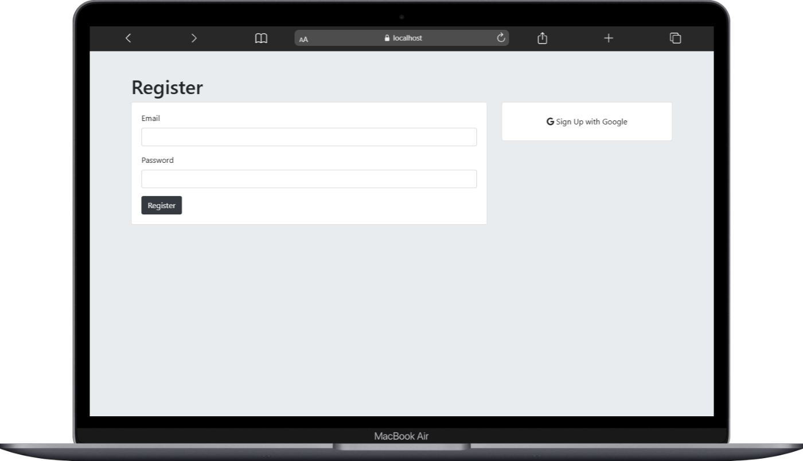
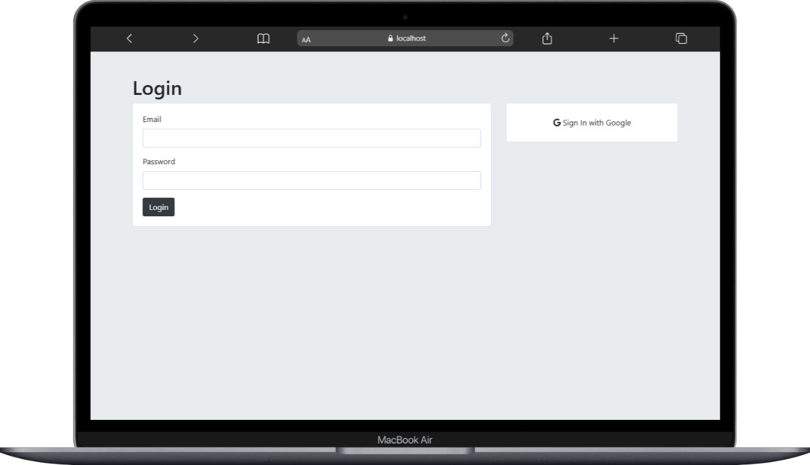

# Authentication (Practice Project)

This project was built to practice understanding **user authentication** using **Node.js, Express, Passport.js, and PostgreSQL**.  
The initial structure came from a Udemy course, but the implementation of logic (login, password hashing, sessions, OAuth setup) was done by me as practice.  

---

### Features
- Register & login with email + password  
- Password hashing with `bcrypt`  
- Session management with `express-session`  
- Google login (OAuth 2.0 via Passport)  

---

### Tech Stack
- Node.js + Express  
- PostgreSQL (`pg`)  
- Passport.js (Local & Google OAuth Strategy)  
- bcrypt  

  <h2>Register and Login Page</h2>
  
  

  <h2>Secret & Submit Page</h2>
  
  

